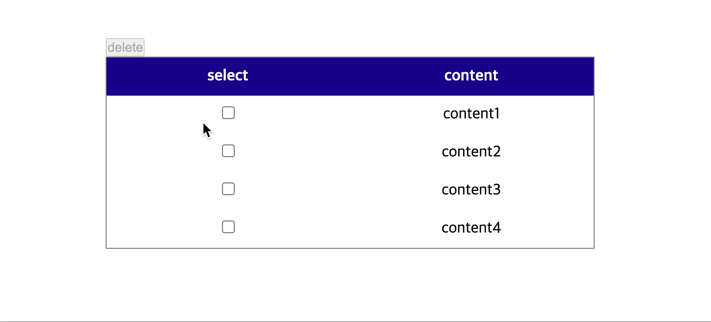

# simple web component example

## Why I tried to use web component?

I was making web page without React and I had to write same code to make delete button in different page.
I thought this is not good to reuse. So I tried to make it as class but I didn't need method.
Finally, I found **web component** which is fit for my situation.

## Using custom tag with web component

When you make custom element with Class, you have to extends specific element what you want to make.
For example,

```
class DeleteBtn extends HTMLElment {
  // something what you want
}
```

could make error. So you have to change extends.

```
class DeleteBtn extends HTMLButtonElement {
  // something what you want
}
```

## What I made?



## Reference

[MDN Web Docs](https://developer.mozilla.org/ko/docs/Web/Web_Components/Using_custom_elements)
